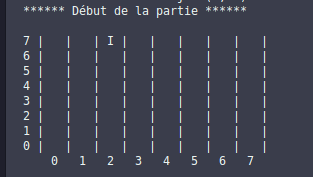
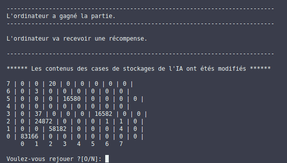

# Wythoff AI

## README

### Name
Wythoff AI

### Description
You'll find in the project the code for the board game "Wythoff's game", normally played by two players, but here played against the computer. The computer stores each game in memory and modifies its data according to victories or defeats. As the game progresses, the "AI" becomes almost unbeatable, and becomes the proof of the mathematical reasoning that wins the game.

The game has no applications or graphical interfaces. It is played in a terminal

The language used in the game and the code is French.

Rules of Wythoff game displayed in-game (in french) :
----------------------------------------------------------------------------
            Règles du jeu de Whytoff (Humain contre Ordinateur)
----------------------------------------------------------------------------
Règles : 1 - Un joueur affronte l'ordinateur.
         2 - Le jeu se déroule sur un damier.
         3 - Les joueurs jouent à tour de rôle en déplaçant un jeton.
         4 - Les mouvements possibles sont les suivants :
              - Se déplacer vers la gauche.
              - Se déplacer vers le bas.
              - Se déplacer le long d'une diagonale vers la gauche et le bas.
         5 - L'ordinateur commence en premier.

----------------------------------------------------------------------------
                            Modes de jeu
----------------------------------------------------------------------------
        1 - Normal (L'IA part de 0)
        2 - Impossible (L'IA s'entraine contre elle-même avant de lançer la partie)
----------------------------------------------------------------------------
                           Apprentissage
----------------------------------------------------------------------------                        
Suivant qu'il gagne ou perd, l'ordinateur reçoit une récompense ou une punition.

### Visuals
Screenshots of the terminal :

### Installation
The program is coded with python3
[To download python](https://www.python.org/downloads/)

### Support
mail : william.mhn7@gmail.com

### Authors and acknowledgment
By williammhn and C-B. Alexis

### License
MIT License

Copyright (c) [2024] [Morhan William]

Permission is hereby granted, free of charge, to any person obtaining a copy
of this software and associated documentation files (the "Software"), to deal
in the Software without restriction, including without limitation the rights
to use, copy, modify, merge, publish, distribute, sublicense, and/or sell
copies of the Software, and to permit persons to whom the Software is
furnished to do so, subject to the following conditions:

The above copyright notice and this permission notice shall be included in
all copies or substantial portions of the Software.

THE SOFTWARE IS PROVIDED "AS IS", WITHOUT WARRANTY OF ANY KIND, EXPRESS OR
IMPLIED, INCLUDING BUT NOT LIMITED TO THE WARRANTIES OF MERCHANTABILITY,
FITNESS FOR A PARTICULAR PURPOSE AND NONINFRINGEMENT. IN NO EVENT SHALL THE
AUTHORS OR COPYRIGHT HOLDERS BE LIABLE FOR ANY CLAIM, DAMAGES OR OTHER
LIABILITY, WHETHER IN AN ACTION OF CONTRACT, TORT OR OTHERWISE, ARISING FROM,
OUT OF OR IN CONNECTION WITH THE SOFTWARE OR THE USE OR OTHER DEALINGS IN
THE SOFTWARE.

### Project status
This project is close but could be updatable

